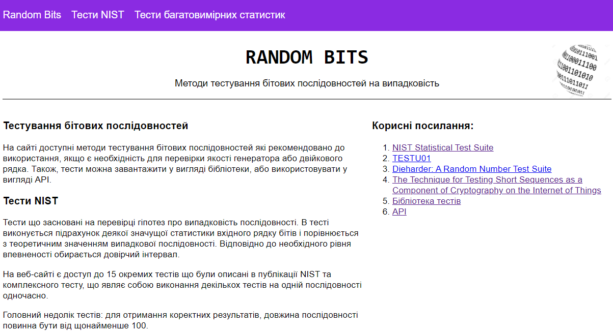
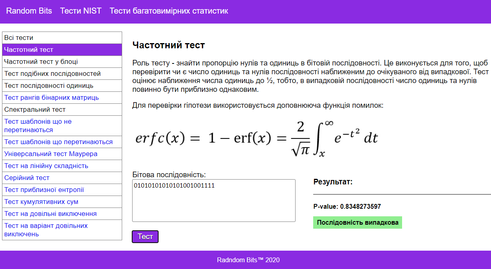

## Front end for Statistical Tests web application

#### General
This is a front end for the [Library of statistical tests for randomness](https://github.com/Leenocktopus/random-bit-sequence-test) 
and respective [back end](https://github.com/Leenocktopus/statistical-tests-API). 
This project as well as the server developed to provide 
easy access to the randomness tests from aforementioned library.
Together, all 3 project provide a diverse range of avenues to use
randomness tests:
 - As a standalone Java library
 - As an API that can be used in existing applications
 - As a web application with an intuitive interface.

Technologies used: *React.js, JavaScript, HTML, CSS.*

#### Website description 
The website has a standard navigation panel, that provides
links to the following pages:
 -  **Main Page**
 
 This page is just a collection of information about randomness
 tests implemented in the project.
 
 - **NIST Tests page**
 
 This page tasked with providing actual tests as well as short
 descriptions of their purpose in sequence assessment. Each test
 can be performed solitary, irrespective to the others. To perform a 
 number of tests at once, one can select "All tests" item in the side menu.  
  
 - **NIST Tests page**

 Much like the previous page, this page provides exact same functions
 but for multidimensional statistics. 
   
#### Design
The pages are somewhat cluttered and far from clarity and brevity. 
The UI was more of necessity rather than the core feature
of the whole project, but it can be improved in the further revisions
(sometime in 2021). 

#### Sample images

- Main page

- Page with a randomness test

